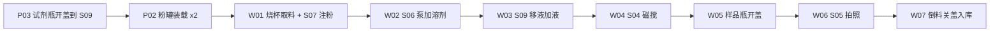

# 单样品原子工作流梳理

> 源文件：`szlab_single_sample_atomic_workflow_flow.json`  
> 流程名：`szlab_single_sample_atomic_workflow`  
> 触发：`S10 取试剂瓶` rising（`value=true`）  
> 共 **38** 步（index 1–38），其中 index 16 标记为 `execution_bypassed: true`

本文档按业务阶段梳理动作顺序，并汇总各设备方法的入参 / 出参。出参以设备 Action 返回的 `dict` 为准；机械臂类动作统一走 `_submit_robot_task`，成功时返回 `success/message` 及任务元数据。

---

## 1. 流程总览

本流程完成「单样品」从试剂准备 → 固体加样 → 溶剂/微量液体添加 → 磁搅 → 倒料灌装 → 成品入库的端到端加工。



### 涉及设备

| device_id | 工位 | 角色 |
| --- | --- | --- |
| `szlab_mixer_robot` | S12 机械臂 | 全部取放 / 倒料 / S071 取罐并行旋转 |
| `szlab_s08_cap_station` | S08 | 开/关盖 |
| `szlab_s07_solid_addition` | S07 | 粉罐扫码、注粉 |
| `szlab_s06_pump` | S06 | 泵加溶剂 |
| `szlab_mixer_pipetting_station` | S09 | 烧杯微量加液 |
| `szlab_s04_magnetic_stirring` | S04 | 磁搅加热 |
| `szlab_s05_photoshotting` | S05 | 烧杯姿势拍照检测 |

### 产品类型速查（本流程实际取值）

| 工位 / 字段 | 取值 | 含义（本流程语境） |
| --- | ---: | --- |
| S08 `product_type` | 1 | 样品瓶（250ml 语境） |
| S08 `product_type` | 3 | 100ml 液体试剂瓶 |
| S08 `position` | 1 | 样品瓶开盖工位 |
| S08 `position` | 2 | 液体瓶开盖工位 |
| S08 倒料 `product_type` | 1 | 样品瓶 250ml |
| S09 `product_type` | 2 | 液体试剂瓶 |
| S09 `product_type` | 3 | 烧杯 |
| S03 `product_type` | 1 | 烧杯 |
| S03 `product_type` | 2 | 样品瓶 |
| S072 `product_type` | 1 | 粉罐 |
| S072 `product_type` | 2 | 烧杯 |
| S11 `product_type` | 1 | 烧杯成品 |
| S11 `product_type` | 2 | 样品瓶成品 |

---

## 2. 阶段详解

### P03｜试剂瓶准备（index 1–5）

| # | 节点 | 设备 | 方法 | 本流程入参 | 说明 |
| ---: | --- | --- | --- | --- | --- |
| 1 | S10 取试剂瓶 | robot | `submit_pick_from_s10` | `position=1` | 从 S10 取液体试剂瓶 |
| 2 | S08 放瓶 | robot | `submit_place_to_s08` | `product_type=3, position=2` | 放到液体瓶开盖位 |
| 3 | S08 开/关盖 | S08 | `process_cap` | `工艺选择=5, 样品ID=[101], 瓶盖暂存位=1` | 5=开盖 100ml 液体瓶 |
| 4 | S08 取瓶 | robot | `submit_pick_from_s08` | `product_type=3, position=2` | 取已开盖液体瓶 |
| 5 | S09 放料 | robot | `submit_place_to_s09` | `product_type=2, position=1` | 放到 S09 液体瓶位 1，供后续移液 |

### P02｜粉罐装载 ×2（index 6–14）

先扫码盘点，再对粉罐 1、粉罐 2 各执行：S072 取 → S071 放 →（取罐 + S07 旋转上料）并行 → S072 放回。

| # | 节点 | 设备 | 方法 | 本流程入参 |
| ---: | --- | --- | --- | --- |
| 6 | S07 粉罐扫码盘点 | S07 | `scan_powder_cartridges` | `{}` |
| 7 | S072 取料 | robot | `submit_pick_from_s072` | `product_type=1, position=1` |
| 8 | S071 放粉罐 | robot | `submit_place_to_s071` | `position="auto"` |
| 9 | 并行取罐+旋转上料 | robot | `submit_pick_from_s071_and_rotate_to_feed` | `position="1-1", load_position=1` |
| 10 | S072 放料 | robot | `submit_place_to_s072` | `product_type=1, position=1` |
| 11–14 | 同上，粉罐 2 | 同上 | 同上 | 取/放 `position=2`；`load_position=2`；S071 仍 `position="auto"` / 并行取 `"1-1"` |

> **注意**：`submit_place_to_s071` 实机不支持 `position="auto"`，必须在 Task 启动前解析为具体槽位（`1-1`…`2-3`）。当前 JSON 字面量 `"auto"` 会在执行时报错。  
> 另：`submit_pick/place_*_s072` 签名仅有 `product_type`，JSON 里的 `position` 会被忽略（语义上区分粉罐 1/2 靠前后上下文 / occupancy）。

### W01｜烧杯取料 + 注粉（index 15–17）

| # | 节点 | 设备 | 方法 | 本流程入参 | 说明 |
| ---: | --- | --- | --- | --- | --- |
| 15 | S03 取容器 | robot | `submit_pick_from_s03` | `product_type=1, position="1-1"` | 取空烧杯 |
| 16 | S072 放料 | robot | `submit_place_to_s072` | `product_type=2, position=1` | **`execution_bypassed: true`，跳过** |
| 17 | S07 注粉 | S07 | `dose_powder` | `coarse_position=1, fine_position=1, target_weight=1, params_json=null, recipe_name="default"` | 粗/精位均用 1 号粉，目标 1 g |

### W02｜S06 泵加溶剂（index 18–21）

| # | 节点 | 设备 | 方法 | 本流程入参 |
| ---: | --- | --- | --- | --- |
| 18 | S072 取料 | robot | `submit_pick_from_s072` | `product_type=2, position=1` |
| 19 | S06 放料 | robot | `submit_place_to_s06` | `{}` |
| 20 | S06 泵加液 | S06 | `run_solvent_addition` | `process=3, volume_pump_1=10, volume_pump_2=10, skip_level_check=false, beaker_true_means_present=true` |
| 21 | S06 取料 | robot | `submit_pick_from_s06` | `{}` |

`process=3`：1 号 + 2 号泵都加液。

### W03｜S09 移液加液（index 22–24）

| # | 节点 | 设备 | 方法 | 本流程入参 |
| ---: | --- | --- | --- | --- |
| 22 | S09 放料 | robot | `submit_place_to_s09` | `product_type=3, position=1` |
| 23 | S09 烧杯加液 | S09 | `add_liquid_to_beaker` | 见下表 |
| 24 | S09 取料 | robot | `submit_pick_from_s09` | `product_type=3, position=1` |

`add_liquid_to_beaker` 本流程入参：

| 参数 | 值 | 含义 |
| --- | --- | --- |
| `take_tip_box_index` | 1 | 取 TIP 盒工位 |
| `release_tip_box_index` | 2 | 放 TIP 盒工位 |
| `tip_index` | 1 | TIP 编号 |
| `liquid_bottle_index` | 1 | 液体瓶 1（即 P03 放入的试剂） |
| `station` | 1 | 加液工位 |
| `aspirate_volume` / `dispense_volume` | 5000 | 抽/放液量（`volume_unit=raw`） |
| `skip_level_check` | false | 不跳过液位检查 |
| `S09液体瓶1~5剩余液量` | null | 不覆盖写入剩余液量 |

### W04｜S04 磁搅（index 25–26）

| # | 节点 | 设备 | 方法 | 本流程入参 |
| ---: | --- | --- | --- | --- |
| 25 | S04 放料 | robot | `submit_place_to_s04` | `position=1, sample_id="sample-001"` |
| 26 | S04 磁搅 | S04 | `run_stirring` | `position=1, mode=3, speed=300, temperature=25, duration=30, safe_temperature=80, reset=false` |

`mode=3`：搅拌 + 加热；`duration=30` 秒。

### W05｜样品瓶开盖（index 27–29）

| # | 节点 | 设备 | 方法 | 本流程入参 |
| ---: | --- | --- | --- | --- |
| 27 | S03 取容器 | robot | `submit_pick_from_s03` | `product_type=2, position="1-1"` |
| 28 | S08 放瓶 | robot | `submit_place_to_s08` | `product_type=1, position=1` |
| 29 | S08 开/关盖 | S08 | `process_cap` | `工艺选择=3, 样品ID=[101], 瓶盖暂存位=3` |

`工艺选择=3`：开盖 250ml 样品瓶。

### W06｜S05 拍照检测（index 30–32）

| # | 节点 | 设备 | 方法 | 本流程入参 |
| ---: | --- | --- | --- | --- |
| 30 | S04 取料 | robot | `submit_pick_from_s04` | `position=1` |
| 31 | S05 放料 | robot | `submit_place_to_s05` | `sample_id="sample-001"` |
| 32 | 烧杯姿势拍照 | S05 | `take_photo` | `sample_id="sample-001", photo_path="", inspection_result="", require_material=false` |

### W07｜倒料、关盖、入库（index 33–38）

| # | 节点 | 设备 | 方法 | 本流程入参 |
| ---: | --- | --- | --- | --- |
| 33 | S05 取料 | robot | `submit_pick_from_s05` | `sample_id="sample-001"` |
| 34 | S08 倒料 | robot | `submit_pour_from_s08` | `product_type=1` |
| 35 | S11 放成品 | robot | `submit_place_to_s11` | `product_type=1, position="1-1"` |
| 36 | S08 开/关盖 | S08 | `process_cap` | `工艺选择=4, 样品ID=[101], 瓶盖暂存位=3` |
| 37 | S08 取瓶 | robot | `submit_pick_from_s08` | `product_type=1, position=1` |
| 38 | S11 放成品 | robot | `submit_place_to_s11` | `product_type=2, position="1-1"` |

顺序含义：烧杯内容倒入已开盖样品瓶 → 空烧杯入 S11 → 样品瓶关盖（工艺 4）→ 样品瓶入 S11。

---

## 3. 设备出入参契约

### 3.1 `szlab_mixer_robot`（机械臂）

**通用出参**（成功）：

```text
{
  "success": true,
  "message": "机器人任务已完成: <station> <task>",
  // 以及 _last_task 展开字段：task / station / task_number / status / ...
}
```

失败时通常含 `success=false`、`message`，以及 `task` / `station` / `position` 等上下文。

| 方法 | 入参 | 本流程是否使用 |
| --- | --- | --- |
| `submit_pick_from_s10` | `position: int=1` | ✓ |
| `submit_place_to_s08` / `submit_pick_from_s08` | `product_type: int=1`, `position: int=1` | ✓ |
| `submit_pour_from_s08` | `product_type: int=1`（1=250ml，2=500ml） | ✓ |
| `submit_place_to_s09` / `submit_pick_from_s09` | `product_type: int`, `position: int` | ✓ |
| `submit_pick_from_s072` / `submit_place_to_s072` | `product_type: int=1` | ✓（JSON 额外 `position` 无效） |
| `submit_place_to_s071` | `position: "1-1"\|...\|"2-3"` | ✓（当前 `"auto"` 需预解析） |
| `submit_pick_from_s071_and_rotate_to_feed` | `position: str="1-1"`, `load_position: int=1` | ✓ |
| `submit_pick_from_s03` | `product_type: int=1`, `position: str="1-1"` | ✓ |
| `submit_place_to_s06` / `submit_pick_from_s06` | 无参 | ✓ |
| `submit_place_to_s04` | `position: int=1`, `sample_id: str=""` | ✓ |
| `submit_pick_from_s04` | `position: int=1` | ✓ |
| `submit_place_to_s05` / `submit_pick_from_s05` | `sample_id: str=""` | ✓ |
| `submit_place_to_s11` | `product_type: int=1`, `position: str="1-1"` | ✓ |

### 3.2 `szlab_s08_cap_station`

**方法**：`process_cap`

| 入参 | 类型 | 说明 |
| --- | --- | --- |
| `工艺选择` | int 1–6 | 1/3/5=开盖，2/4/6=关盖；1–2=500ml，3–4=250ml，5–6=100ml 液体瓶 |
| `样品ID` | `list[int]` | 本流程均为 `[101]` |
| `瓶盖暂存位` | int 1–5 | 液体瓶用 1；样品瓶用 3 |

**出参**：`{success, message, ...}`（开/关盖内部状态字段）。

### 3.3 `szlab_s07_solid_addition`

#### `scan_powder_cartridges`

| | |
| --- | --- |
| 入参 | 无 |
| 出参 | `{success, ..., qr_codes?}`（成功时附扫码结果） |

#### `dose_powder`

| 入参 | 类型 | 本流程值 | 说明 |
| --- | --- | --- | --- |
| `coarse_position` | int 1–10 | 1 | 粗注粉位 |
| `fine_position` | int 1–10 | 1 | 精注粉位 |
| `target_weight` | float | 1 | 目标质量 (g) |
| `params_json` | str \| null | null | 可选配方 JSON |
| `recipe_name` | str | `"default"` | 配方名 |

**出参（成功时关键字段）**：`success`、`balance_reading`、`target_weight`、`recipe_name`、`display_message`（含偏差）、可选 `balance_history_*`。

### 3.4 `szlab_s06_pump`

**方法**：`run_solvent_addition`

| 入参 | 类型 | 本流程值 | 说明 |
| --- | --- | --- | --- |
| `process` | int 1–3 | 3 | 1=仅泵1，2=仅泵2，3=双泵 |
| `volume_pump_1` | int | 10 | 1 号溶液添加量 |
| `volume_pump_2` | int | 10 | 2 号溶液添加量 |
| `skip_level_check` | bool | false | 当前实现中未使用（保留兼容） |
| `beaker_true_means_present` | bool | true | 当前实现中未使用（保留兼容） |

**出参**：

```text
{
  "success": true,
  "message": "S06 工艺 3 加液流程完成",
  "data": {"process": 3, "volume_pump_1": 10, "volume_pump_2": 10},
  "steps": [...]
}
```

### 3.5 `szlab_mixer_pipetting_station`

**方法**：`add_liquid_to_beaker`

| 入参 | 说明 |
| --- | --- |
| `take_tip_box_index` / `release_tip_box_index` | TIP 盒取/放工位 1–2 |
| `tip_index` | TIP 编号 1–96 |
| `liquid_bottle_index` | 液体瓶 1–5 |
| `station` | 加液工位 |
| `aspirate_volume` / `dispense_volume` | 抽/放液量 |
| `volume_unit` | `"raw"` 等 |
| `skip_level_check` | 是否跳过液位检查 |
| `S09液体瓶1~5剩余液量` | 可选覆盖写入；本流程为 null |

**出参（成功）**：`success`、`message="S09 烧杯加液完成"`、`data`（含 `process_sequence`）、`steps` / `logs`。

### 3.6 `szlab_s04_magnetic_stirring`

**方法**：`run_stirring`

| 入参 | 本流程值 | 说明 |
| --- | --- | --- |
| `position` | 1 | 磁搅位 1–6 |
| `mode` | 3 | 1=搅拌，2=加热，3=搅拌+加热 |
| `speed` | 300 | 转速 |
| `temperature` | 25 | 设定温度 |
| `duration` | 30 | 秒（内部转毫秒写 PLC） |
| `safe_temperature` | 80 | 安全温度 |
| `reset` | false | true 时只复位参数不加工 |

**出参（成功）**：

```text
{
  "success": true,
  "message": "...",
  "data": {
    "station", "position", "mode", "mode_label",
    "speed", "temperature", "duration", "duration_ms",
    "safe_temperature", "done_variable", "reset"
  }
}
```

### 3.7 `szlab_s05_photoshotting`

**方法**：`take_photo`

| 入参 | 本流程值 | 说明 |
| --- | --- | --- |
| `sample_id` | `"sample-001"` | 样品标识 |
| `photo_path` | `""` | 保留参数 |
| `inspection_result` | `""` | 保留参数 |
| `require_material` | false | 兼容参数；实机仍要求有料 |

**出参（成功）**：

```text
{
  "success": true,
  "message": "S05 拍照检测完成，结果 OK",
  "data": {
    "sample_id", "photo_path", "photo_url",
    "result_code", "result"   // result 期望 "OK"
  }
}
```

失败时 `result` 可能为 `NG` / `UNKNOWN` 等。

---

## 4. 物料流转简图

```text
S10 液体瓶 ──► S08(开盖) ──► S09 液体瓶位1
S072 粉罐1/2 ──► S071 ──►(旋转上料)──► S072
S03 烧杯 ──► [S072] ──► S07 注粉 ──► S06 泵加液
         ──► S09 移液加液 ──► S04 磁搅 ──► S05 拍照
         ──► S08 倒入样品瓶 ──► S11(烧杯成品)
S03 样品瓶 ──► S08(开盖) ──►(承接倒料)──► S08(关盖) ──► S11(样品瓶成品)
```

---

## 5. 与仓库内完整版差异

`unilabos/.../workflows/szlab_single_sample_atomic_workflow.json` 在流程开头额外包含 **S02→S09 TIP 盒准备**（约 4 步），且触发节点为 `S02 取 TIP`。  
当前 `*_flow.json` 从 **S10 取试剂瓶** 起跳，假设 TIP / 工位前置条件已满足。

---

## 6. 执行前检查清单

1. S071 两处 `position="auto"` 需在编排层解析为真实空槽（如 `1-1` / `1-2`）。
2. index 16（烧杯放到 S072）被 bypass：需确认注粉工位烧杯已在位或由其它路径放置。
3. 样品标识：`sample_id="sample-001"`（S04/S05）与 S08 `样品ID=[101]` 目前不一致，联调时建议统一策略。
4. S09 加液依赖 P03 已将液体瓶放到 `product_type=2, position=1`，且 TIP 盒就绪（本 flow 未含 TIP 准备）。
