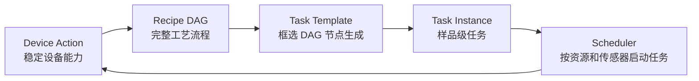
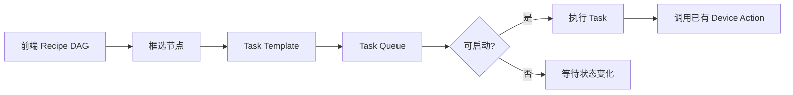
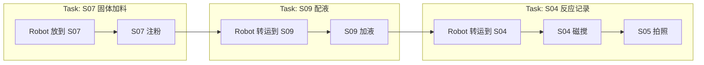
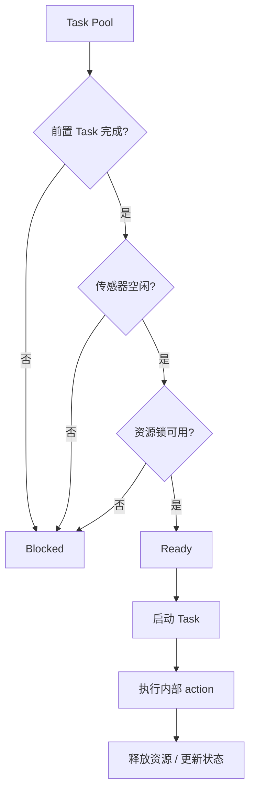
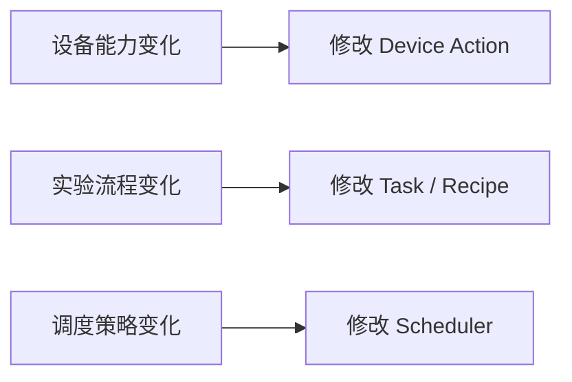

# SZLab Task 编排能力讨论稿

## 背景

SZLab Poly Studio 已接入多个设备 action，包括机械臂转运、S07 固体加料、S08 开关盖、S09 移液、S04 磁搅、S05 拍照等。单个 action 已具备调试基础，下一步问题集中在多样品、多设备、多工位协作时的任务编排和资源调度。

线性 workflow 对单样品调试直观，但在高通量场景中容易让机械臂或工位等待。例如 S07 注粉期间，机械臂已经空闲，理论上可以继续给 S08/S09 放瓶，或准备下一个样品。为避免把这些调度逻辑写死在 action 或线性 DAG 中，需要在现有 workflow 与 device action 之间增加 Task 编排层。

## 核心方案



分层含义：

- **Device Action**：设备能力层，接入完成后尽量稳定。
- **Recipe DAG**：前端仍用 DAG 表达完整工艺流程，负责“人能看懂的 recipe”。
- **Task Template**：从 DAG 中框选一段节点，形成可调度的工艺任务。
- **Task Instance**：每个样品基于 Task Template 生成具体任务实例。
- **Scheduler**：根据前置关系、传感器状态、资源锁选择可启动任务。

## 当前模式与目标模式

当前更接近顺序执行：


目标是引入 Task 调度：



## 前端交互示意

一个线性 DAG 可以被切成多个 Task：



## 调度判断

第一版 Scheduler 不需要复杂优化算法，先完成基础可启动判断：



第一版判断条件：

```text
can_start(task) =
  前置 task 已完成
  && 目标传感器空闲
  && robot / 工站 / 槽位资源未被占用
```

后续可扩展：

- 优先级。
- 等待时间。
- 瓶颈设备权重。
- 高通量设备填槽策略。
- 机械臂路径优化。
- 多机械臂调度。

## 边界划分



原则：

- Device Action 不绑定具体 recipe。
- Recipe DAG 负责表达完整工艺。
- Task 负责将一段工艺变成可调度单元。
- Scheduler 负责运行时资源协调。

## 本次会议目标

需要优先确认以下方向：

1. 是否认可 `Device Action -> Recipe DAG -> Task -> Scheduler` 的分层。
2. Unilab 本身是否其实已经具备了类似功能，或者计划做类似的功能

---

## 补充讨论：Task 前后依赖与 Action 级并行协调

> 补充日期：2026-07-30
> 本节记录当前 SZLab Task 编排实现、并行目标、约束模型与建议实施路径，不代表已经完成实现。

### 问题重述

当前 Task 编排对同一 `sample_id` 使用 `order` 形成强制串行关系：只有较小 `order` 的 Task 全部完成，后续 Task 才能启动。这种策略安全、容易理解，但调度粒度过粗。

例如：

1. Task 1 使用机械臂把烧杯送到 S07。
2. S07 开始注粉，此时机械臂已经空闲。
3. Task 2 需要机械臂把样品瓶送到 S08 开盖。

如果按 Task 整体串行，Task 2 必须等待 Task 1 注粉全部完成；实际上 S07 注粉和机械臂转运样品瓶可以并行。

当前执行协调器已经能避免同一个 `device_name` 的 Action 同时执行，但该互斥状态主要保存在单个协调器进程的内存中。Task API 中虽然存在资源租约模型，Action 认领接口当前并未真正使用这些资源，因此还不能作为跨进程、可恢复的权威资源锁。

### 目标

目标不是让所有 Task 无条件并行，而是：

- 多个 Task 可以同时进入运行态。
- Scheduler 在所有 Task 的“下一 Action”中选择当前可安全执行的 Action。
- 同一设备继续互斥，不同设备允许并行。
- 机械臂只在安全交接点切换 Task。
- 真正存在工艺前后关系时使用显式依赖，不再仅依赖 `sample_id + order` 推断。
- 传感器负责确认物理状态，资源租约负责避免并发竞态。

### 核心原则

#### `sample_id` 不是资源锁

`sample_id` 应用于关联实验、材料、日志和结果，不应自动表示该样品的所有 Task 必须整体串行。

建议：

- `order` 表示默认展示顺序和调度优先级。
- 真正的强依赖由 `depends_on` 显式表达。
- 旧 workspace 可继续使用严格顺序模式，避免升级后直接改变历史流程语义。

#### 调度粒度下沉到 Action

Task 仍然是用户可理解、可编辑的工艺单元，但运行时调度粒度改为 Action。

一个 Action 可执行，需要同时满足：

```text
action_ready(action) =
  Task 已进入可运行状态
  && Task 内部前序 Action 已完成
  && 跨 Task 显式依赖已满足
  && not_before 已到达
  && 所需设备、工位、槽位和物料可以被原子认领
  && 传感器前置条件满足
```

Scheduler 每轮从全局 Ready Action Queue 中选择 Action，而不是一次把整个 Task 独占执行到底。

#### 使用“业务原子级”，而不是 PLC 指令级

不需要把 Task 拆成每次 OPC 写入或每条 PLC 指令。调度边界应放在设备和物料处于稳定状态的位置。

以下 Action 通常可以保持现状：

- 注粉。
- 开关盖。
- 加液。
- 磁搅。
- 拍照。
- 称量。
- 扫码盘点。

前提是 Action 只有在设备真正完成、到达稳定状态后才返回。如果某个 Action 仅发送启动命令便立即返回，则需要改为以下方案之一：

- Action 内部等待设备完成。
- 拆成“启动 / 等待完成”两个阶段，并在期间持续持有设备资源。

### 搬运组

机械臂的 `pick` 和 `place` 虽然是两个 Action，但两者之间机械臂仍持有物料，不能切换去执行另一个 Task。因此需要引入搬运组。

例如：

```text
pick_from_s03 -> place_to_s072
```

整个搬运组持续占用：

- 机械臂设备。
- 机械臂夹爪。
- 被搬运的物料。

只有 `place_to_s072` 成功后才释放这些资源。

存在中间处理动作时，搬运组可以包含多个 Action：

```text
pick_from_s05 -> pour_from_s08 -> place_to_s11
```

此时机械臂和烧杯从 `pick` 开始一直占用到最终 `place` 完成。

实现上有两种可接受方式：

1. 将取放封装为一个 `move(from, to)` Device Action。
2. 保留现有 pick/place Action，通过 `transport_group` 和跨 Action 资源租约保证连续占用。

为了减少设备驱动改动，建议优先采用第二种。

### 显式依赖

依赖至少需要支持两个层级：

- **Task 级依赖**：Task B 必须在 Task A 完成后启动。
- **Action 级依赖**：Task B 的某个 Action 只需要等待 Task A 的某个指定 Action 完成，无需等待整个 Task A。

概念示例：

```json
{
  "depends_on": [
    {
      "instance_id": "task-a",
      "node_id": "place_beaker_to_s07"
    }
  ]
}
```

Action 级依赖适用于“物料已经交接到工位后即可开始下一段流程”的情况。

前序失败或取消时，后续 Action 不应无限显示为普通排队，而应明确进入：

```text
blocked_by_failed_predecessor
```

之后由用户选择重试前序、跳过依赖或终止后续流程。

### 资源模型

建议为资源使用带命名空间的稳定标识，避免不同工位都使用 `1-1` 时发生歧义：

```text
device:szlab_mixer_robot
device:szlab_s07_solid_addition
robot:gripper
station:S072:slot:1
rack:S03:beaker:slot:1-1
rack:S03:sample_vial:slot:1-1
material:{sample_id}:beaker
material:{sample_id}:sample_vial
```

资源认领必须由 Task API 在同一个 workspace 写锁内原子完成：

1. 校验 Action 仍是当前游标对应的 Action。
2. 检查所需资源是否空闲。
3. 创建 Action execution record。
4. 创建资源租约。
5. 提交同一次 workspace 更新。

不能采用“先读传感器、再在客户端写状态”的方式代替原子认领，否则两个协调器可能同时通过检查。

资源释放规则：

- 普通工艺 Action 在完成或明确失败后释放设备资源。
- 搬运组从 start Action 开始持有机械臂、夹爪和物料，在 end Action 成功后释放。
- 搬运失败时不能盲目释放物料状态，需要进入待人工确认状态。
- 协调器异常退出后，设备锁可通过 owner/heartbeat 判断失联，但涉及物料位置的租约不能仅依赖超时自动释放。

### 传感器与资源锁的职责

两者不能互相替代：

- **资源锁**：防止两个 Action 同时计划使用同一设备或位置。
- **传感器**：确认真实物理世界是否与软件状态一致。

推荐执行顺序：

```text
原子认领软件资源
  -> 读取并校验传感器前置条件
  -> 执行设备 Action
  -> 校验传感器后置条件
  -> 更新物料位置
  -> 释放或转移资源租约
```

如果传感器校验失败，应释放尚未产生物理移动的临时设备租约；如果动作已部分执行，则应进入人工恢复流程。

### 全局 Action 调度循环

建议协调器按以下循环运行：

```text
读取 workspace
  -> 收割已完成的 in-flight Action
  -> 计算所有 Task 的下一 Action
  -> 过滤未满足依赖、时间和传感器条件的 Action
  -> 按 order、优先级、等待时间形成稳定队列
  -> 向 Task API 原子认领资源和 Action
  -> 提交到对应设备执行器
  -> 记录等待原因和执行状态
```

第一版不需要复杂优化算法，稳定 FIFO 即可。后续再考虑最短完工时间、工位填槽、路径优化等策略。

### 并行示例

目标执行过程：

```text
Task 1 / 机械臂：取烧杯 -> 放到 S07
Task 1 / S07：                   注粉-----------------
Task 2 / 机械臂：                    取样品瓶 -> 放到 S08
Task 2 / S08：                                      开盖--------
```

在该过程中：

- Task 1 和 Task 2 可以同时处于 running。
- Task 1 放下烧杯前，Task 2 不能使用机械臂。
- Task 1 放下烧杯后，机械臂资源释放。
- S07 注粉只占用 S07，不继续占用机械臂。
- Task 2 随后可以使用机械臂，并与 S07 注粉并行。

### 当前完整 Flow 的初步搬运组

以下仅为设计阶段清单，尚未写入 Flow。Action 1–4 的 TIP 准备动作第一版暂不考虑并行，应禁用或从目标 Flow 中排除。

其余候选搬运组：

1. Action 5–6：S10 取试剂瓶 -> S08 放瓶。
2. Action 8–9：S08 取试剂瓶 -> S09 放料。
3. Action 11–12：S072 取位置 1 旧粉罐 -> S071 放粉罐。
4. Action 13–14：S071 取粉罐并旋转 -> S072 位置 1 放料。
5. Action 15–16：S072 取位置 2 旧粉罐 -> S071 放粉罐。
6. Action 17–18：S071 取粉罐并旋转 -> S072 位置 2 放料。
7. Action 19–20：S03 取烧杯 -> S072 放烧杯。
8. Action 22–23：S072 取烧杯 -> S06 放烧杯。
9. Action 25–26：S06 取烧杯 -> S09 放烧杯。
10. Action 28–29：S09 取烧杯 -> S04 放烧杯。
11. Action 31–32：S03 取样品瓶 -> S08 放瓶。
12. Action 34–35：S04 取烧杯 -> S05 放烧杯。
13. Action 37–39：S05 取烧杯 -> S08 倒料 -> S11 放烧杯。
14. Action 41–42：S08 取样品瓶 -> S11 放样品瓶。

重复的 method 不应自动去重。分组依据应包含：

- 唯一 `workflow_node_id`。
- 动作在当前 Flow 中的出现位置。
- 物料类型。
- 来源和目标工位。
- Task instance 或 sample 的运行时标识。

只有确认属于误配置的重复步骤时，才从 Flow 中删除。

### 建议实施顺序

#### 第一阶段：元数据，不改变运行行为

- 为 Workflow Action 增加可选调度元数据。
- 标注搬运组 start/member/end。
- 标注持续占用的机械臂、夹爪和物料。
- 前端导入、草稿保存、导出和后端执行图必须保留这些字段。
- 增加 schema 和分组连续性测试。

#### 第二阶段：Task API 权威资源租约

- 恢复 Action claim 的资源参数。
- 在服务端原子检查并创建租约。
- 支持搬运组跨 Action 持有资源。
- 补充冲突、幂等重试、失败和进程异常测试。

#### 第三阶段：全局 Ready Action Queue

- 协调器同时扫描所有 Task 的下一 Action。
- 保留同设备互斥。
- 允许不同设备 Action 并行。
- 增加 pick/place 不可被其他 Task 插入的测试。

#### 第四阶段：显式依赖与兼容迁移

- 将 `order` 从强依赖改为优先级。
- 增加 Task/Action 显式依赖。
- 旧 workspace 默认保持严格顺序模式。
- 新 Flow 经确认后启用 Action 级并行模式。

#### 第五阶段：前端与联调

- 显示多个同时运行的 Task。
- 显示“等待机械臂”“等待工位”“等待前序 Action”等原因。
- 在模拟器验证注粉期间机械臂执行开盖准备。
- 模拟验证通过后，再以低速、单样品、人工监护方式进行真机测试。

### 第一版验收标准

- 同一机械臂绝不同时执行两个 Action。
- pick 与对应 place 之间不能插入其他机械臂 Task。
- S07 注粉期间机械臂可以执行其他安全搬运。
- 不同设备可以并行执行。
- 同一槽位不能被两个 Action 同时认领。
- 资源冲突表现为等待，而不是设备执行失败。
- 前序失败后，后续 Task 显示明确阻塞原因。
- 协调器重启后不会把未知物料位置自动判定为空闲。
- 旧 workspace 在未显式启用新模式时保持原有顺序行为。

### 待确认事项

1. 所有工艺 Action 是否都会等待设备真正完成后才返回。
2. S071“取粉罐并旋转”实际占用的设备范围是否同时包含机械臂与 S07。
3. S08 倒料过程中机械臂是否始终持有烧杯。
4. Action 1–4 是长期移除，还是仅在第一版并行调度中禁用。
5. 不同工位中的 `1-1` 应采用何种稳定资源命名。
6. 第一版是否只允许单个执行协调器，还是必须立即支持多协调器故障切换。